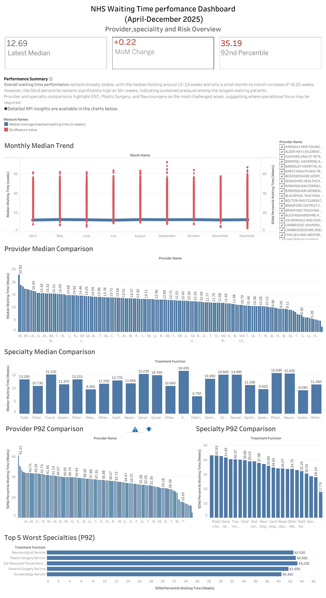

# NHS Healthcare Data Analysis Dashboard
Project Overview

This project explores healthcare activity data from the UK National Health Service (NHS).
The goal of the analysis is to identify patterns in healthcare demand, patient activity, and service usage.

Using Tableau, the data is transformed into an interactive dashboard that helps visualize trends in healthcare services and highlights areas with higher demand.

The project demonstrates how data visualization can support better understanding of healthcare system activity and operational pressures.

## Problem Statement
How can NHS patient activity trends be visualized to identify high-demand services and support resource planning?

## Tools & Methods
- Tableau for visualization
- CSV dataset for data input
- Data cleaning and exploration in Excel 

## Dataset
The dataset used in this project is publicly available from the UK NHS [[link to dataset]](https://www.england.nhs.uk/statistics/statistical-work-areas/rtt-waiting-times/rtt-data-2025-26/).
The dataset contains healthcare service data related to the NHS.
It includes information about service activity, patient demand, and healthcare usage trends.

## Dashboard Preview

## Key Insights
- Patient activity peaks during winter months
- Certain services consistently show high demand
- Regional differences highlight potential resource allocation needs

## Repository Structure

data/ → dataset used for the analysis

dashboard/ → Tableau packaged workbook (.twbx)

images/ → dashboard screenshots

## Author

Data visualization project created as part of a data analytics learning portfolio.

